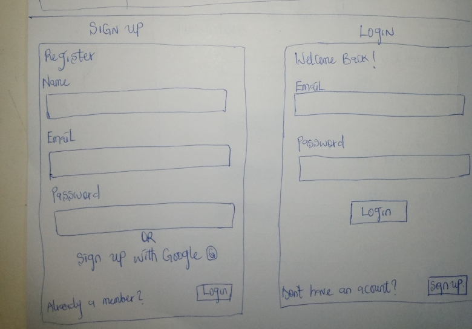
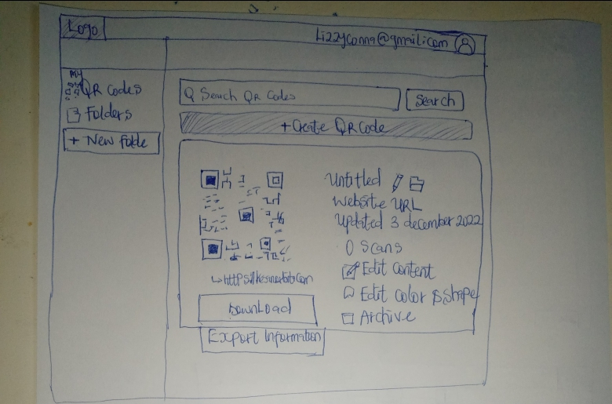
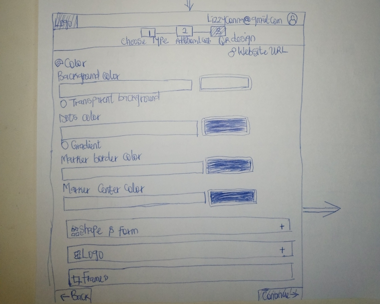
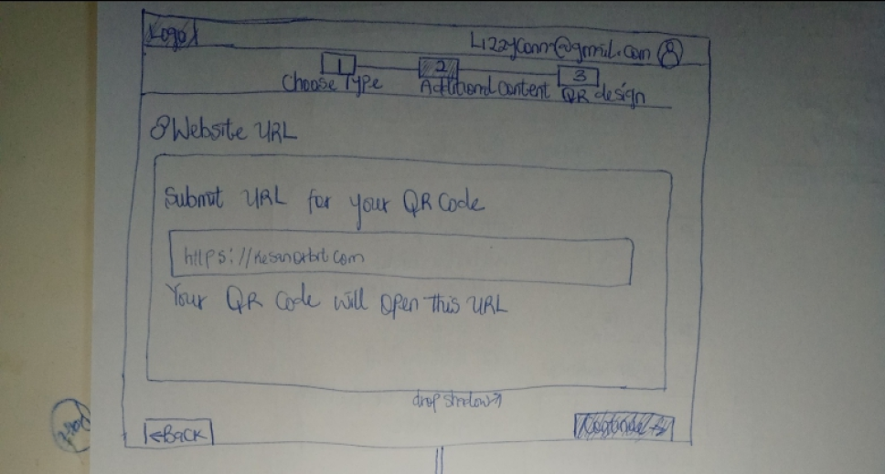
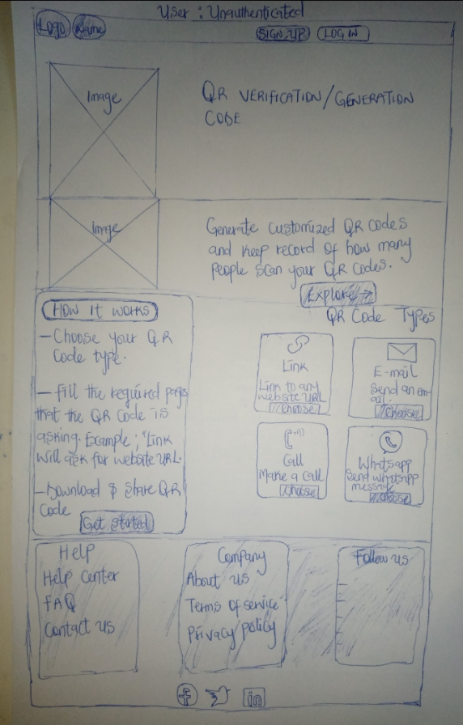

# TeamGaurpp-QR_GEN
A platform that allows users generate QR code that specifically does something when scanned.

## Table of contents

- [Overview](#overview)
  - [The challenge](#the-challenge)
  - [Screenshot](#screenshot)
  - [Links](#links)
- [My process](#my-process)
  - [Built with](#built-with)
  - [What I learned](#what-i-learned)
  - [Continued development](#continued-development)
  - [Useful resources](#useful-resources)
- [Author](#author)
- [Acknowledgments](#acknowledgments)

## Overview

### The challenge

User: Unauthenticated
    - Visit the platform to view basic information about it
    - View and Interact with the documentation
    - Register to view more details
    - No access to use until registered
User: Authenticated
    - Full access to the platform
    - Allow setting on what should happen when qr is scanned - give at least 2 options
    - Allow user to download (allow png, jped and pdf download format), or share code by email or social media
    - Allow user save data and come back to it

### Screenshot
This incude images of our design sketch, Data Schema, and the Project Design

### Links

- Solution URL: [Add solution URL here](https://your-solution-url.com)
- Live Site URL: [Add live site URL here](https://your-live-site-url.com)

## My process

### Built with

FRONTEND TECHNOLOGIES
- HTML
- CSS
- Javascript

BACKEND TECHNOLOGIES
- Node.js
- Express

DATABASE
- MongoDB

### Continued development

Use this section to outline areas that you want to continue focusing on in future projects. These could be concepts you're still not completely comfortable with or techniques you found useful that you want to refine and perfect.

### Useful resources

## Author
The work is done by the following team

 - [Abiodun Shittu](https://www.github.com/Abiodun-Shittu)
 - [Williams Ashibuogwu](https://www.github.com/wbizmo)
 - [Woyengikuro Subiri](https://www.github.com/Kurolinks)
 - [Increase-Chris Alaede](https://www.github.com/Ra-Kim)
 - [Joseph Ajemba](https://www.github.com/Scotcee)
 - [Mary Nledo](https://www.github.com/MaryJaneFrances)
 - [Musab Mubaraq Mburaimoh](https://www.github.com/kingmusab-tmt)
 - [Chinomso Maxwell](https://www.github.com/Maxlizzy)
 - [Ameerah Adeyemi](https://www.github.com/Ameerah10)
 - [Alapakasa Tamunoigbeinbia](https://www.github.com/Alapakasa11)
 - [Oluwamuyiwa Ashogbon](https://www.github.com/Ekstasee007)
 - [Rachel Baba-Yusuf](https://www.github.com/Awesomerach)
 - [Chinonye Umeh](https://www.github.com/Umeh-Chinonye)

## Acknowledgments

We wish to appreciate the zuri team for giving us the priviledge to ..................

