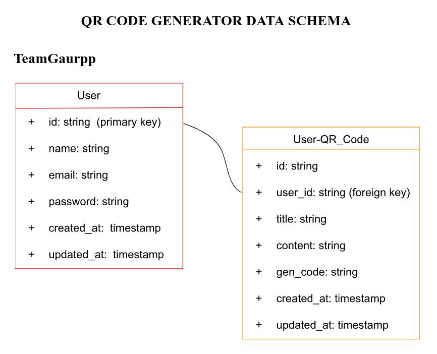

# TeamGaurpp-QR_GEN
A platform that allows users generate QR code that specifically does something when scanned.

## Table of contents

- [Overview](#overview)
  - [The challenge](#the-challenge)
  - [Screenshot](#screenshot)
  - [Links](#links)
- [My process](#my-process)
  - [Built with](#built-with)
  - [What I learned](#what-i-learned)
  - [Continued development](#continued-development)
  - [Useful resources](#useful-resources)
- [Author](#author)
- [Acknowledgments](#acknowledgments)

## Overview

## The challenge

### User: Unauthenticated
  - Visit the platform to view basic information about it
  - View and Interact with the documentation
  - Register to view more details
  - No access to use until registered
### User: Authenticated
  - Full access to the platform
  - Allow setting on what should happen when qr is scanned - give at least 2 options
  - Allow user to download (allow png, jpeg and pdf download format), or share code by email or social media
  - Allow user save data and come back to it

### Screenshot
This incude images of our design sketch, Data Schema, and the Project Design

### Links
- API Hosting: [Vercel](https://qr-gen-api.vercel.app/)
- API Documentation: [Postman](https://documenter.getpostman.com/view/21176038/2s8YzTUi4G)
- Project Documentation: [Google Docs](https://docs.google.com/document/d/18CAtGBg1heat-YJ4IQunDS9CSKkP0nGVW6gGXbUZv3c/edit?usp=sharing)
- Product Design: [Figma](https://www.figma.com/file/WruzpDxJXAqq1OaNuUHhy6/QR-Generator?node-id=0%3A1&t=SUIgIh20EmQ72Mpq-0)
- Live Site: [Vercel](https://qr-gen-app.vercel.app/)

## My process

### Built with

FRONTEND TECHNOLOGIES
- HTML
- CSS
- Javascript

BACKEND TECHNOLOGIES
- Node.js
- Express

DATABASE
- MongoDB

### Useful resource

## Author
The work is done by the following team members

 - [Abiodun Shittu](https://www.github.com/Abiodun-Shittu)
 - [Ashibuogwu Williams](https://www.github.com/wbizmo)
 - [Woyengikuro Subiri](https://www.github.com/Kurolinks)
 - [Increase-Chris Alaede](https://www.github.com/Ra-Kim)
 - [Joseph Ajemba](https://www.github.com/Scotcee)
 - [Mary Nledo](https://www.github.com/MaryJaneFrances)
 - [Musab Mubaraq Mburaimoh](https://www.github.com/kingmusab-tmt)
 - [Chinomso Maxwell](https://www.github.com/Maxlizzy)
 - [Ameerah Adeyemi](https://www.github.com/Ameerah10)
 - [Alapakasa Tamunoigbeinbia](https://www.github.com/Alapakasa11)
 - [Oluwamuyiwa Ashogbon](https://www.github.com/Ekstasee007)
 - [Rachel Baba-Yusuf](https://www.github.com/Awesomerach)
 - [Chinonye Umeh](https://www.github.com/Umeh-Chinonye)

## Acknowledgments

We wish to appreciate the zuri team for giving us the privilege to successfully complete the project phase 

